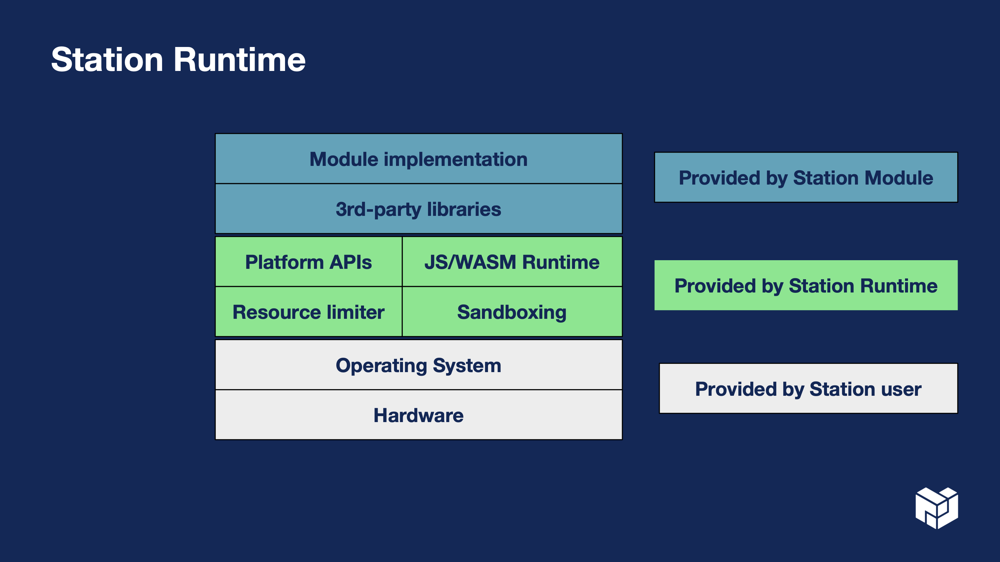

<h1 align="center">
	<br>
	 🌼
	<br>
	<br>
	Zinnia
	<br>
	<br>
	<br>
</h1>

> A runtime for interplanetary volunteer computing.
>
> Powering 🛰️ [Filecoin Station](https://github.com/filecoin-station/filecoin-station).

## Installation

See [CLI Installation](./cli/README.md#installation).

## Basic use

```js
while (true) {
  const start = new Date();
  const res = await fetch(
    "https://ipfs.io/ipfs/bafybeigdyrzt5sfp7udm7hu76uh7y26nf3efuylqabf3oclgtqy55fbzdi/",
  );
  console.log(`TTFB: ${new Date() - start}ms`);
  await new Promise((resolve) => setTimeout(resolve, 1000));
}
```

```bash
$ zinnia run example.js
TTFB: 235ms
...
```

See also [example modules](./examples).

## API

See [Building Modules](./docs/building-modules.md).

## Architecture



### Components

- **JS/WASM engine:** [deno_core](https://crates.io/crates/deno_core), see the decision record for
  [Switching to Deno Core](docs/architecture-decision-records/2023-01-switching-to-deno-core.md)
- **Non-blocking I/O:** [Async Rust](https://rust-lang.github.io/async-book/),
  [Tokio](https://tokio.rs)
- **Networking**: [deno_fetch](https://crates.io/crates/deno_fetch),
  [rust-libp2p](https://github.com/libp2p/rust-libp2p)
- **IPFS:** _TBD_
- **Block (K/V) storage:** _TBD_

## Contributing

The [roadmap](https://www.notion.so/pl-strflt/Zinnia-Roadmap-b849d322502f4c079525cd8cc887df02) and
[issue tracker](https://github.com/filecoin-station/zinnia/issues) are great places to check out for
your first time to contribute! You can also look up some past decisions in
[docs/architecture-decisions-records/](docs/architecture-decision-records/).

If you see something broken or missing, please
[create a new issue](https://github.com/filecoin-station/zinnia/issues/new).

Finally, don't forget to stop by and **say hi** :wave: in #filecoin-station-module-builders-wg on
[Filecoin Slack](https://filecoin.io/slack)!

## Fun fact

Zinnia was
[named after the first flower to blossom in space](https://www.nasa.gov/image-feature/first-flower-grown-in-space-stations-veggie-facility).

<div align="center">
  
  <br>
	<br>
</div>
